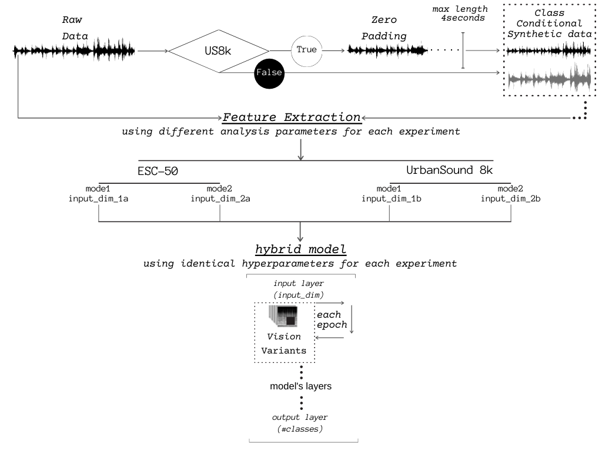
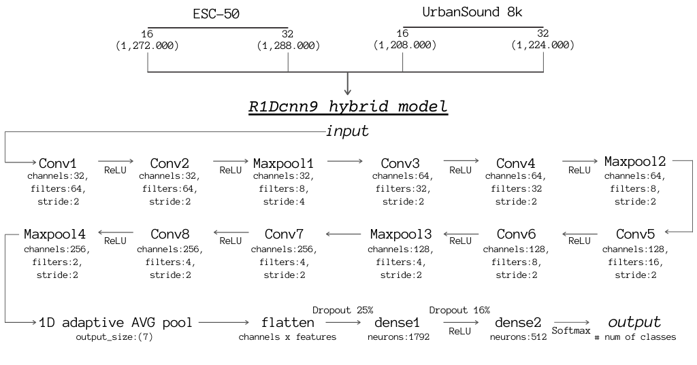
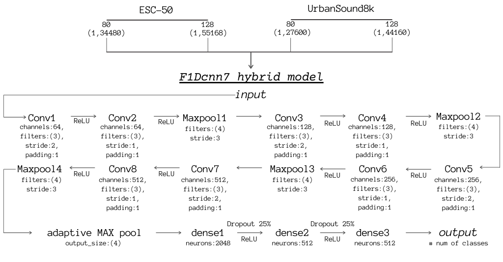
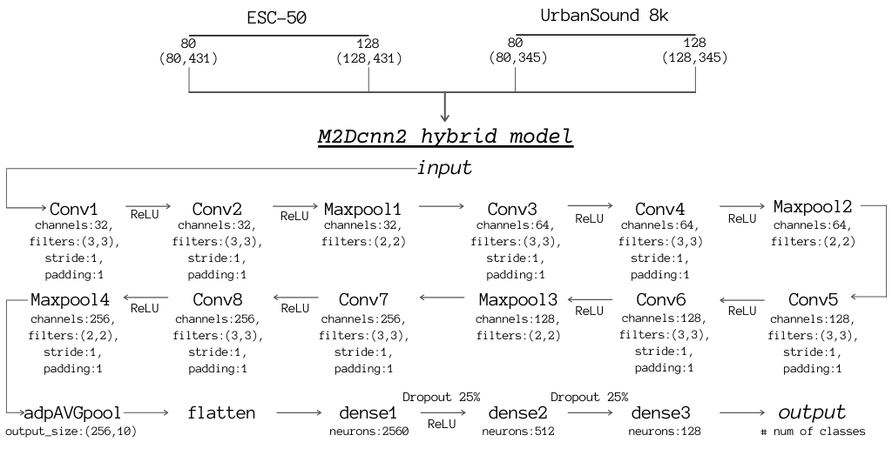
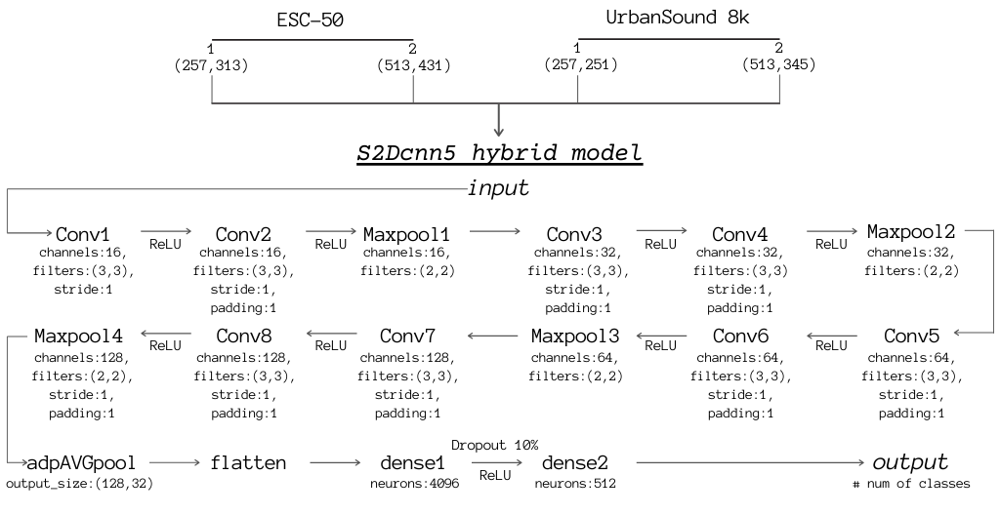
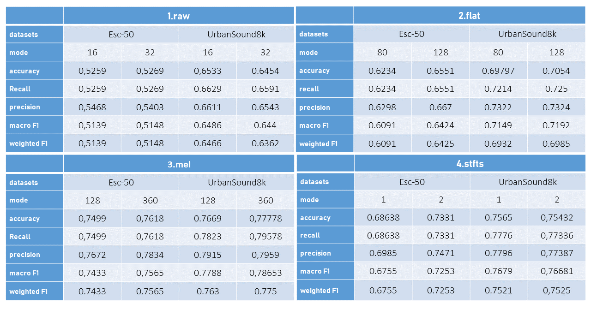

# Audio signal classification using deep learning algorithms

In this thesis we compared the performance of multiple feature parameters for environmental sound classification problems by developing multiple evaluating models. Specifically, as audio representation of 2 different datasets, we used waveforms, log-mel spectrograms and short-time Fourier transforms. Finally we set 4 different experiments and each one of them was divided in two discrete audio representation modes. For their evaluation and also for comparability purposes we developed hybrid CNN models. Along with comparing each mode within each experiment, we also compared the performances achieved by using each different dataset through inspecting and examining the factors of structure, the technical features and various prospects of the initial data distribution, respectively for each dataset. The nature of this research additionally enabled us to seek for potential environmental class-conditional audio features.

### Contents

- [Datasets](#datasets)
- [Audio_representations](#features)
- [Data_augmentation](#augmentation)
- [Method](#method)
- [Models](#models)
- [Results](#results)

#### Folders' Structure

│   Presentation.pptx
│   README.md
│
├───analysis_parameters
│       MEL_Parameters_experiment[esc50].ipynb
│       STFTs_Parameters_experiment[esc50].ipynb
│
├───arch
│       1.raw.png
│       2.flat.png
│       3.mel.png
│       4.stfts.png
│       method.png
│
├───code
│   │   1.raw_ESC-50.ipynb
│   │   2.flat_ESC-50.ipynb
│   │   2.flat_UrbanSound8k.ipynb
│   │   3.mel_ESC-50.ipynb
│   │   3.mel_UrbanSound8k.ipynb
│   │   4.stfts_ESC-50.ipynb
│   │
│   ├───1.raw_UrbanSound8k[hpc]
│   │
│   └───4.stfts_UrbanSound8k
│ 
│
├───datanalysis
│   │   DCase13_DataAnalysis_and_visualizations.ipynb
│   │   Esc50_DataAnalysis_and_visualizations.ipynb
│   │   UrbanSound8k_DataAnalysis_and_visualizations.ipynb
│   │
│   ├───esc50
│   │
│   └───us8k
│
├───other
│       esc_3.mel[new_features+DenseNet_121].ipynb
│       esc_4.stfts[new_features+DenseNet_121].ipynb
│
└───results
    │   1.raw[kfold].png
    │   2.flat[kfold].png
    │   3,mel[kfold].png
    │   4.stfts[kfold].png
    │   general.png
    │   Preprocess_Average&Analytical_Results.ipynb
    │
    └───Analytical
        ├───1.raw
        │   ├───esc50
        │   │   ├───16
        │   │   │
        │   │   └───32
        │   │
        │   └───us8k
        │       ├───16
        │       │
        │       └───32
        │
        ├───2.flat
        │   ├───esc50
        │   │   ├───128
        │   │   │
        │   │   └───80
        │   │
        │   └───us8k
        │       ├───128
        │       │
        │       └───80
        │
        ├───3.mel
        │   ├───esc50
        │   │   ├───128
        │   │   │
        │   │   ├───360
        │   │   │
        │   │   └───80(unofficial)
        │   │
        │   └───us8k
        │       ├───128
        │       │
        │       ├───360
        │       │
        │       └───80(unofficial)
        │
        └───4.stfts
            ├───esc50
            │   ├───1
            │   │
            │   └───2
            │
            └───us8k
                ├───1
                │
                └───2

#### Tools

- code implementation : [python3] (https://www.python.org/) 
- environment/packages : [miniconda3] (https://docs.conda.io/projects/conda/en/latest/)
- framework : [pytorch] (https://github.com/pytorch/pytorch)
- feature extraction/synthetic data : [librosa] (https://librosa.org/)
- image augmentation : [torchvision](https://github.com/pytorch/vision)

#### Datasets

- ESC-50 : (https://github.com/karolpiczak/ESC-50)
- UrbanSound8k : (https://urbansounddataset.weebly.com/urbansound8k.html)

#### Audio_representations

- 1.raw : 1D raw waveform
- 2.flat : 1D flattened log mel-spectogram
- 3.mel : 2D log mel-spectogram
- 4.stfts : 2D short-time Fourier transform

#### Data_augmentation

- Audio data augmentation: White Noise, Time Stretching, Time Shifting, Pitch Shifting
- Image data augmentation (2D exps) : Random Flip, Random Erasing

#### Method

<h4 align="center">General method scheme concerning all experiments:</h4>

#### Models

<h4 align="center">1.raw architecture scheme</h4>

 
<h4 align="center">2.flat architecture scheme</h4>

<h4 align="center">3.mel architecture scheme</h4>

<h4 align="center">4.stfts architecture scheme</h4>

 

 
 #### Results
 
<h4 align="center">Average</h4>

 

 
<h4 align="center">
 <a href="https://github.com/pasquale90/mthesis/tree/master/Results">analytical fold results</a>
</h4>
 
<h4 align="center">
 <a href = "https://github.com/pasquale90/mthesis/tree/master/Results/Analytical">analytical class results</a>
</h4>
  

 
